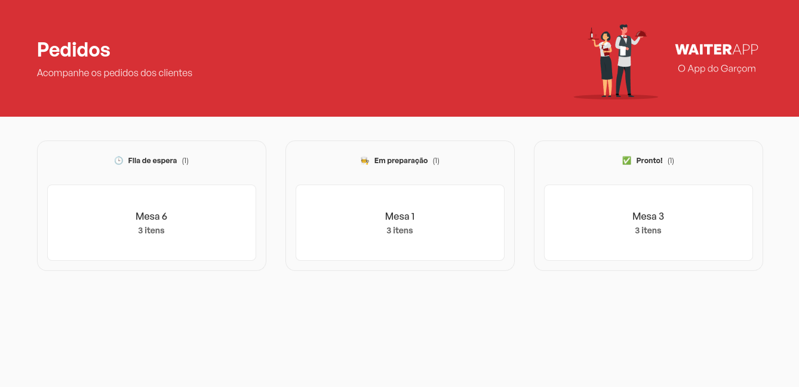
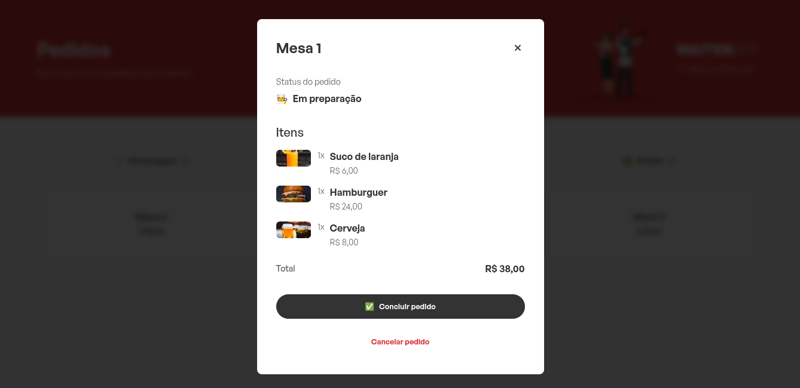

<h1 align="center">
   Waiter
</h1>

# Screens

 

## Technologies used

- [React](https://pt-br.reactjs.org/)
- [Vite](https://vitejs.dev/)
- [Typescript](https://www.typescriptlang.org)
- [Styled Components](https://styled-components.com)
- [SocketIO](https://socket.io)

## Projeto:

Waiter: é um App web que recebe os pedidos feito pelo app mobile.

## Requirements

You need to install both [Node.js](https://nodejs.org) and
[Yarn](https://yarnpkg.com) or npm to run this project.

## How to use it

```bash
# Install the dependencies
$ yarn install
# Run the web server
$ yarn dev
```

The app will be available for access on your browser at (http://localhost:5173)
